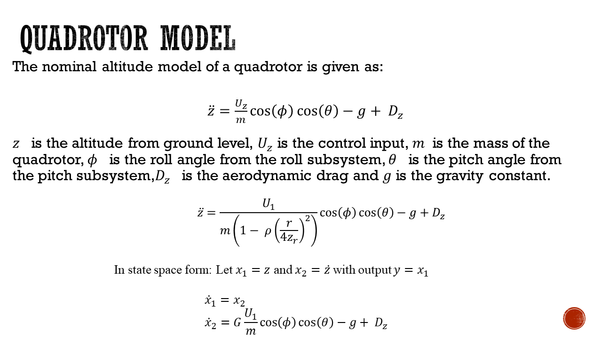
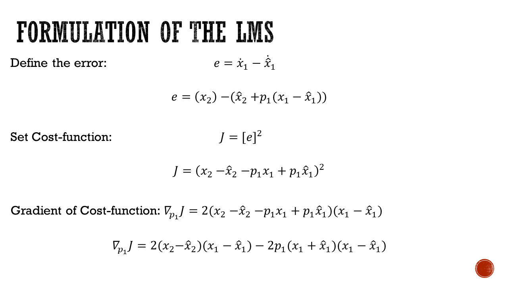
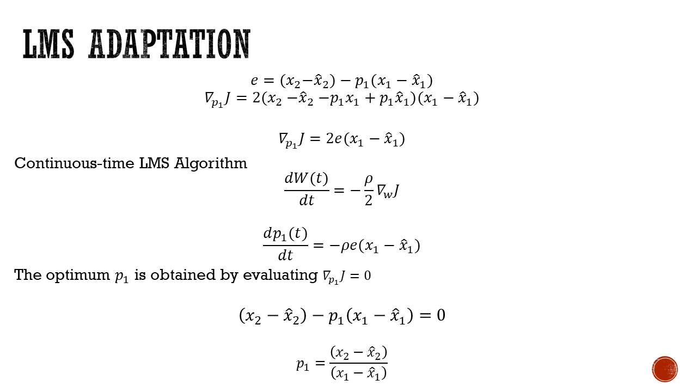
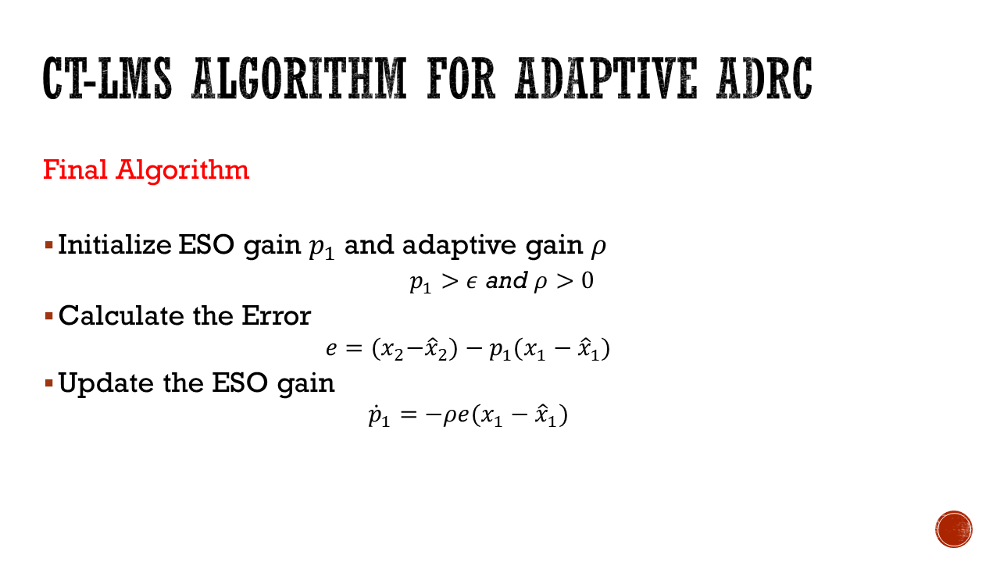
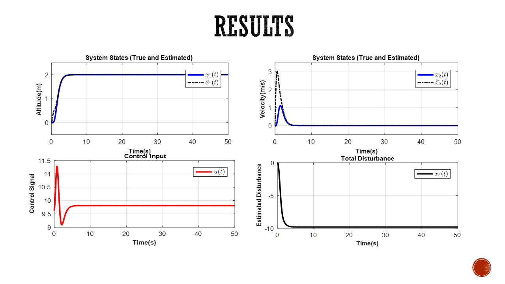

# Adaptive Active Disturbance Rejection Control

## Introduction

The altitude control of a quadrotor unmanned aerial vehicle is treated using its altitude dynamics in hover mode. An LMS-based Adaptive Active disturbance rejection control (AADRC) is proposed to compensate for disturbance effects resulting in smoother control.

## Description
An LMS algorithm for the adaptation of the observer gain was presented to automatically tune the ESO observer. The ESO observer linearizes the altitude dynamics. Subsequently, a PD controller was implemented for the linearized dynamics and was successfully simulated in Matlab

The Altitude dynamics of a Quadrotor is given as follows:  
  
  

Formulation of the ADRC Controller:  
    
    
Formulation of the AADRC Controller using LMS:  
  
  
  

## Results
The figure below shows the result of applying the AADRC for Altitude control
  
